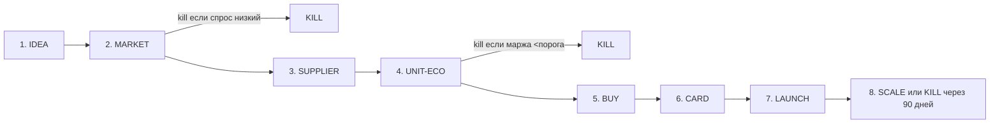

# Фазы и гейты пайплайна

7 рабочих фаз + финал (SCALE/KILL). Между фазами — явные гейты с чек-листом. Gate не закрыт → следующая фаза не стартует.



---

## Фаза 1 — IDEA

**Вход**: гипотеза (категория, тип товара, предполагаемое УТП).

**Что делаем**:
1. Фиксируем идею в `products/<sku>/brief.yaml`.
2. Проверяем, что не торгуем уже в этой нише (self-cannibalization).
3. Оцениваем синергию со складом/логистикой/экспертизой.

**Артефакт**: `brief.yaml` с полями `hypothesis`, `category_guess`, `price_range_guess`, `usp_draft`, `existing_ourself`.

**Гейт → MARKET**: идея сформулирована в одном предложении + предполагаемая ценовая полка.

---

## Фаза 2 — MARKET (Валидация рынка)

**Вход**: `brief.yaml`.

**Что делаем**:
1. MPStats API — категория целиком:
   - Топ-30 SKU по выручке (без склеек).
   - Распределение: на первой странице выручка у 20-го места должна быть ≥300 000 ₽/мес (скорректировано под наш бюджет 1 млн).
2. Фильтр по новизне: заведено ≤180 дней, отзывов ≤100.
3. Проверка сезонности (Trends): не падающий ли тренд за 6 мес.
4. Semantic API: объём основной семантики ≥50 000 показов/мес.

**Артефакт**: `market.yaml` + CSV топ-30 конкурентов.

**Гейт → SUPPLIER** (kill-критерии):
- [ ] Рынок растёт или стабилен за 6 мес.
- [ ] Выручка на первой странице распределена плавно (отношение топ-1 / топ-20 ≤ 10×).
- [ ] Есть ≥3 новых SKU с динамикой продаж.
- [ ] Суммарная частотность основных запросов ≥50 000.

Если хотя бы 2 пункта не выполнены — **KILL**.

---

## Фаза 3 — SUPPLIER (Поставщик)

**Вход**: `market.yaml`.

**Что делаем**:
1. Поиск на 1688 по фото (взять у топ-3 конкурентов).
2. Фильтр: фабрика ≥3 лет, повторные покупки ≥20%, «красный бык» / «фиолетовый бриллиант».
3. Запрос образца + вопросов (скрипт из курса).
4. Расчёт логистики: карго (18-25 дн / 12-16 дн), авиа (8-12 дн).
5. Сертификация: узнать у лаборатории срок/цену декларации соответствия. С сентября 2026 — обязательно.

**Артефакт**: `supplier.yaml` — фабрика, MOQ, цена FOB, логистика, сертификат (срок/цена).

**Гейт → UNIT-ECO**:
- [ ] Найдено ≥2 фабрики-кандидата.
- [ ] Цена + логистика укладываются в 35–45% от ожидаемой розницы.
- [ ] Получены реальные фото/видео продукта.
- [ ] Понятно, какая нужна декларация/сертификат и её стоимость.

---

## Фаза 4 — UNIT-ECO (Юнит-экономика)

**Вход**: `supplier.yaml` + `market.yaml`.

**Что делаем**:
1. Загружаем актуальные комиссии из `commissions/wb-2026-04.yaml` и `commissions/ozon-2026-04.yaml`.
2. Считаем отдельно для WB и Ozon:
   ```
   Profit = Price - (COGS + Fulfillment + MP_Commission + Logistics_client
                     + Refunds_logistics + Defect_rate × Price + Ad_spend + Tax_on_revenue)
   ROI_year = (Profit_per_batch / Capital_invested) × Cycles_per_year
   ```
3. Прогоняем чувствительность по ценовым точкам, выкупу, ДРР.
4. Налог: УСН 6% Доходы + (пока по умолчанию) НДС 5% без вычетов — закрыть после Q1.

**Артефакт**: `unit.yaml` — таблица сценариев, решение (WB/Ozon/оба/ни одной).

**Гейт → BUY** (пороги маржи):
- [ ] WB: маржа ≥15%, ДРР ≤10%.
- [ ] Ozon: маржа ≥12%, ДРР ≤20%.
- [ ] Годовой ROI ≥150%.
- [ ] Оборачиваемость ≤90 дней от закупки до поступления денег.

Если **ни одна** площадка не проходит → **KILL**.

---

## Фаза 5 — BUY (Закупка)

**Вход**: `unit.yaml` с решением по площадке(ам).

**Что делаем**:
1. Оформляем заказ фабрике (с авансом 30% обычно).
2. Параллельно — подаём заявку на декларацию соответствия.
3. Логистика: выбираем маршрут, заключаем договор с посредником.
4. Таможня: готовим документы к ДТ (через брокера).
5. Штрихкоды/маркировка — если категория требует.

**Артефакт**: `buy-log.yaml` — инвойс, трек, ДТ, сертификат (номер, ссылка в реестр).

**Гейт → CARD**:
- [ ] Товар выехал с фабрики.
- [ ] Сертификат/декларация оформлена, занесена в реестр.
- [ ] Штрихкоды готовы, маркировка заказана.

---

## Фаза 6 — CARD (Карточка)

**Вход**: готовый товар (или на подходе) + `market.yaml` для SEO.

**Что делаем**:
1. Собираем SEO-ядро (MPStats API из топ-30 конкурентов, фильтр НЧ <1000, удаление латиницы).
2. Пишем заголовок (ВЧ слова, в лимит площадки).
3. Описание: WB — широко с ключами, Ozon — **сухо**, лишний текст в Rich-контент.
4. Характеристики: заполняем все поля шаблона.
5. ТЗ дизайнеру на инфографику: 8 слайдов, первый — УТП, закрытие болей из отзывов конкурентов.
6. Загрузка карточки через API (WB Content, Ozon Product).

**Артефакт**: `card.yaml` — SEO-ядро, тексты, ТЗ дизайнеру, ссылки на WB/Ozon карточки.

**Гейт → LAUNCH**:
- [ ] Карточка проходит модерацию на обеих (если обе) площадках.
- [ ] Инфографика 8 слайдов готова.
- [ ] Rich-контент (Ozon) загружен.
- [ ] Ссылка на сертификат привязана.

---

## Фаза 7 — LAUNCH (Запуск)

**Вход**: карточка опубликована, товар на складе МП.

**Что делаем**:
1. Отгрузка FBO на 5–6 региональных складов WB / кросс-докинг Ozon.
2. «Баллы за отзывы» WB (единственная легальная механика, мин. 21 день, предоплата).
3. «Отзывы за баллы» Ozon.
4. РК:
   - WB: Аукцион + АвтоРК (из АвтоРК исключить ключевые слова).
   - Ozon: Трафареты (автостратегия) → через 7–14 дней Вывод в топ.
5. Ежедневный мониторинг: CTR, CR, конверсия в заказ, ДРР.

**Артефакт**: `launch.yaml` + `sales-log.csv` (ежедневно).

**Гейт → SCALE** (через 30 дней):
- [ ] Получено ≥20 отзывов ≥4.5 ★.
- [ ] ДРР в пределах плана.
- [ ] Маржа на практике ≥80% от плановой.
- [ ] Органические показы ≥30% от общих.

---

## Фаза 8 — SCALE или KILL

После 90 дней от запуска — жёсткое решение.

**SCALE**:
- Расширяем цвета/размеры/модели.
- Докупаем партию 2–5× больше.
- Добавляем 1–2 новых SKU в смежной нише.
- Реинвестируем 40–60% чистой прибыли в следующую новинку.

**KILL**:
- Сливаем остатки по скидке.
- Удаляем карточку.
- Фиксируем в `decisions.md` причину провала.
- Товары «аутсайдеры» не должны превышать 10% портфеля.

---

## Матрица гейтов (сводно)

| Фаза | Главный kill-критерий |
|---|---|
| 2 MARKET | рынок падает или Top-1/Top-20 > 10× |
| 4 UNIT-ECO | нет площадки, где маржа/ROI проходят пороги |
| 7 LAUNCH → SCALE | маржа практическая <80% от плановой через 30 дней |
| 8 SCALE → KILL | ROI за 90 дней <50% годовых |
