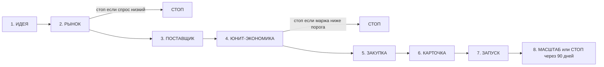

# Фазы и контрольные точки конвейера

7 рабочих фаз + финал (масштаб или стоп). Между фазами — явные контрольные точки с чек-листом. Контрольная точка не закрыта → следующая фаза не стартует.



---

## Фаза 1 — ИДЕЯ

**Вход:** гипотеза (категория, тип товара, предполагаемое преимущество).

**Что делаем:**
1. Фиксируем идею в `products/<артикул>/brief.yaml`.
2. **Фильтр против самоканнибализации:** проверяем, что не попадает в текущий ассортимент продавца — строительный инструмент, наборы инструмента, ручной инструмент, автоинструмент. Если попадает — предупреждение «возможна конкуренция со своим товаром» + ручное подтверждение.
3. Оцениваем синергию со складом / логистикой / экспертизой.

**Артефакт:** `brief.yaml` с полями `hypothesis`, `category_guess`, `price_range_guess`, `usp_draft`, `existing_ourself`.

**Контрольная точка → РЫНОК:** идея сформулирована в одном предложении + предполагаемая ценовая полка.

---

## Фаза 2 — РЫНОК (валидация рынка)

**Вход:** `brief.yaml`.

**Что делаем:**
1. MPStats API — категория целиком:
   - Топ-30 артикулов по выручке (без склеек).
   - Распределение: на первой странице выручка у 20-го места должна быть не меньше 300 000 ₽/мес (скорректировано под наш бюджет 1 млн).
2. Фильтр по новизне: создан не больше 180 дней назад, отзывов не больше 100.
3. Проверка сезонности (Trends): не падающий ли тренд за 6 месяцев.
4. Раздел поисковых запросов: объём основной семантики не меньше 50 000 показов в месяц.

Полный маппинг «правило → точка доступа → параметры» + пример скрипта разведки: [mpstats-api-catalog](../updates/mpstats-api-catalog.md).

**Артефакт:** `market.yaml` + csv с топ-30 конкурентов.

**Контрольная точка → ПОСТАВЩИК** (критерии стопа):
- [ ] Рынок растёт или стабилен за 6 месяцев.
- [ ] Выручка на первой странице распределена плавно (отношение топ-1 / топ-20 не больше 10×).
- [ ] Есть не меньше 3 новых артикулов с динамикой продаж.
- [ ] Суммарная частотность основных запросов не меньше 50 000.

Если хотя бы 2 пункта не выполнены — **СТОП**.

---

## Фаза 3 — ПОСТАВЩИК

**Вход:** `market.yaml`.

**Что делаем:**
1. Поиск на 1688 по фото (взять у топ-3 конкурентов).
2. Фильтр: фабрика не меньше 3 лет, повторные покупки не меньше 20%, иконки «красный бык» / «фиолетовый бриллиант».
3. Запрос образца + список вопросов (скрипт из курса).
4. Расчёт логистики: карго (18–25 дней / 12–16 дней), авиа (8–12 дней).
5. Сертификация: узнать у лаборатории срок и цену декларации соответствия. С сентября 2026 — обязательно.

**Артефакт:** `supplier.yaml` — фабрика, минимальная партия (MOQ), цена при погрузке на корабль (FOB), логистика, сертификат (срок и цена).

**Контрольная точка → ЮНИТ-ЭКОНОМИКА:**
- [ ] Найдено не меньше 2 фабрик-кандидатов.
- [ ] Цена + логистика укладываются в 35–45% от ожидаемой розницы.
- [ ] Получены реальные фото и видео продукта.
- [ ] Понятно, какая нужна декларация или сертификат и её стоимость.

---

## Фаза 4 — ЮНИТ-ЭКОНОМИКА

**Вход:** `supplier.yaml` + `market.yaml`.

**Что делаем:**
1. Загружаем актуальные комиссии из `commissions/wb-2026-04.yaml` и `commissions/ozon-2026-04.yaml`.
2. Считаем отдельно для WB и Ozon:
   ```
   Profit = Price - (COGS + Fulfillment + MP_Commission + Logistics_client
                     + Refunds_logistics + Defect_rate × Price + Ad_spend + Tax_on_revenue)
   ROI_year = (Profit_per_batch / Capital_invested) × Cycles_per_year
   ```
3. Прогоняем чувствительность по ценовым точкам, выкупу, доле рекламных расходов.
4. Налог: УСН 6% «Доходы» + (пока по умолчанию) НДС 5% без вычетов — закрыть после первого квартала.

**Артефакт:** `unit.yaml` — таблица сценариев, решение (WB / Ozon / обе / ни одной).

**Контрольная точка → ЗАКУПКА** (пороги маржи):
- [ ] WB: маржа не меньше 15%, доля рекламных расходов не больше 10%.
- [ ] Ozon: маржа не меньше 12%, доля рекламных расходов не больше 20%.
- [ ] Годовая доходность капитала не меньше 150%.
- [ ] Оборачиваемость не больше 90 дней от закупки до поступления денег.

Если **ни одна** площадка не проходит — **СТОП**.

---

## Фаза 5 — ЗАКУПКА

**Вход:** `unit.yaml` с решением по площадке (или площадкам).

**Предварительная проверка:** проверяем, что в Фонде новинок хватает на текущую закупку + буфер на следующую (не меньше 3 средних закупок). Подробно — [budget-cycle](budget-cycle.md). Если фонд меньше — ждём накопления, не стартуем.

**Что делаем:**
1. Оформляем заказ фабрике (с авансом 30% обычно).
2. Параллельно — подаём заявку на декларацию соответствия.
3. Логистика: выбираем маршрут, заключаем договор с посредником.
4. Таможня: готовим документы к таможенной декларации (через брокера).
5. Штрихкоды и маркировка — если категория требует.

**Артефакт:** `buy-log.yaml` — счёт, отслеживание, таможенная декларация, сертификат (номер, ссылка в реестр).

**Контрольная точка → КАРТОЧКА:**
- [ ] Товар выехал с фабрики.
- [ ] Сертификат или декларация оформлена, занесена в реестр.
- [ ] Штрихкоды готовы, маркировка заказана.

---

## Фаза 6 — КАРТОЧКА

**Вход:** готовый товар (или на подходе) + `market.yaml` для поисковых запросов.

**Что делаем:**
1. Собираем семантическое ядро (MPStats API из топ-30 конкурентов, фильтр низкочастотных меньше 1000, удаление латиницы).
2. Пишем заголовок (высокочастотные слова, в лимит площадки).
3. Описание: WB — широко с ключами, Ozon — **сухо**, лишний текст в расширенное описание (Rich-контент).
4. Характеристики: заполняем все поля шаблона.
5. Техническое задание дизайнеру на инфографику: 8 слайдов, первый — преимущество, закрытие болей из отзывов конкурентов.
6. Загрузка карточки через API (WB Content, Ozon Product).

**Артефакт:** `card.yaml` — семантическое ядро, тексты, техническое задание дизайнеру, ссылки на карточки WB и Ozon.

**Контрольная точка → ЗАПУСК:**
- [ ] Карточка проходит модерацию на обеих (если обе) площадках.
- [ ] Инфографика 8 слайдов готова.
- [ ] Расширенное описание (Rich-контент) Ozon загружено.
- [ ] Ссылка на сертификат привязана.

---

## Фаза 7 — ЗАПУСК

**Вход:** карточка опубликована, товар на складе площадки.

**Что делаем:**
1. Отгрузка со склада площадки (FBO) на 5–6 региональных складов WB / прямая отгрузка через хаб Ozon.
2. «Баллы за отзывы» WB (единственная легальная механика, минимум 21 день, предоплата).
3. «Отзывы за баллы» Ozon.
4. Рекламные кампании:
   - WB: «Аукцион» + «АвтоРК» (из «АвтоРК» исключить ключевые слова).
   - Ozon: «Трафареты» (автоматическая стратегия) → через 7–14 дней «Вывод в топ».
5. Ежедневный мониторинг: кликабельность, конверсия, конверсия в заказ, доля рекламных расходов.

**Артефакт:** `launch.yaml` + `sales-log.csv` (ежедневно).

**Контрольная точка → МАСШТАБ** (через 30 дней):
- [ ] Получено не меньше 20 отзывов и не меньше 4,5 ★.
- [ ] Доля рекламных расходов в пределах плана.
- [ ] Маржа на практике не меньше 80% от плановой.
- [ ] Органические показы не меньше 30% от общих.

---

## Фаза 8 — МАСШТАБ или СТОП

После 90 дней от запуска — жёсткое решение.

**МАСШТАБ:**
- Расширяем цвета, размеры, модели.
- Докупаем партию в 2–5 раз больше.
- Добавляем 1–2 новых артикула в смежной нише.
- Возвращаем 40–60% чистой прибыли в следующую новинку.

**СТОП:**
- Распродаём остатки по скидке.
- Удаляем карточку.
- Фиксируем в `decisions.md` причину провала.
- Товары-«отстающие» не должны превышать 10% портфеля.

---

## Сводная таблица контрольных точек

| Фаза | Главный критерий стопа |
|---|---|
| 2 РЫНОК | Рынок падает или топ-1 / топ-20 больше 10× |
| 4 ЮНИТ-ЭКОНОМИКА | Нет площадки, где маржа и доходность проходят пороги |
| 7 ЗАПУСК → МАСШТАБ | Маржа на практике меньше 80% от плановой через 30 дней |
| 8 МАСШТАБ → СТОП | Доходность за 90 дней меньше 50% годовых |
